# 🚀 NEON ASTEROIDS

Clásico *Asteroids* con estética **retro-moderna de neón**, generado **100% de forma procedimental** y contenido en un **único archivo `index.html`**. Sin sprites, sin pistas de audio, sin librerías externas a las del propio Three.js — todo (formas, partículas, sonidos y música) se sintetiza en tiempo real.

> **Escrito 100% por IA.** Este juego ha sido creado íntegramente por **DeepSeek V4 Flash 0731** (el modelo que impulsa a este asistente) a partir de indicaciones generales en lenguaje natural: *"un clon de Asteroids en un único archivo con Three.js, neón, sonido procedural y power-ups"*. Yo no escribí ni una línea de código — el asistente lo diseñó, implementó, depuró y documentó todo por sí solo.
>
> Es una IA excelente para programar y, además, gasta menos que la moto de un jipi: consume una cantidad ridícula de tokens para lo que es capaz de generar. 😄

## 📸 Capturas

Capturas reales del juego (modo WebGL con bloom), tal cual salieron del navegador:

| | |
|---|---|
| 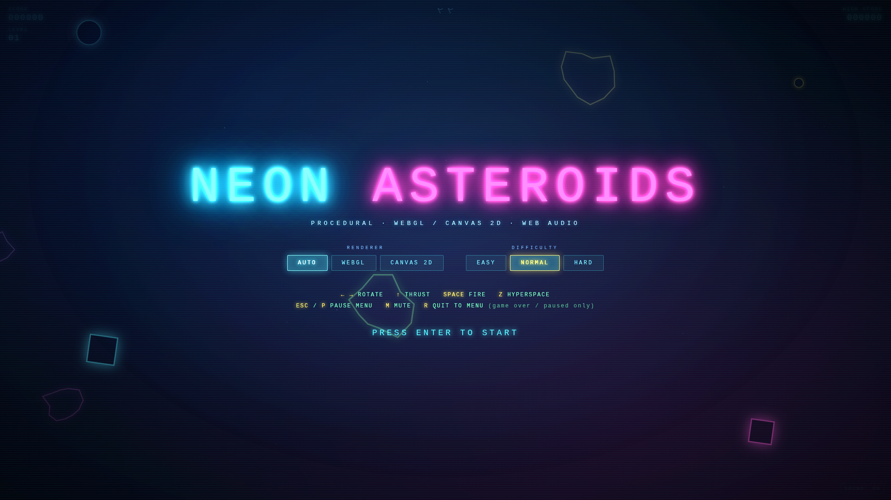 | 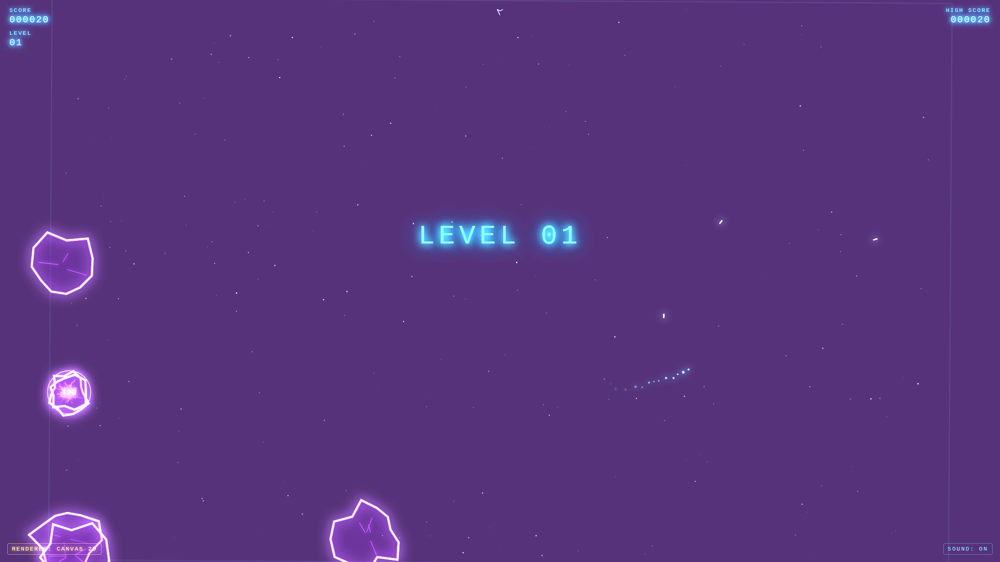 |
| **Menú principal** — asteroides a la deriva y neón | **Explosión** — las partículas llenan la pantalla |
| 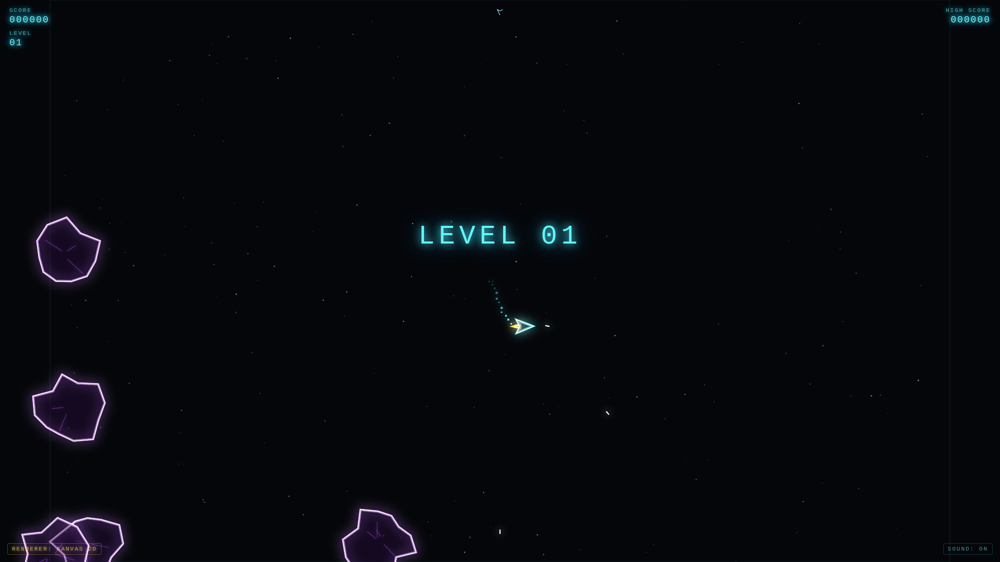 | 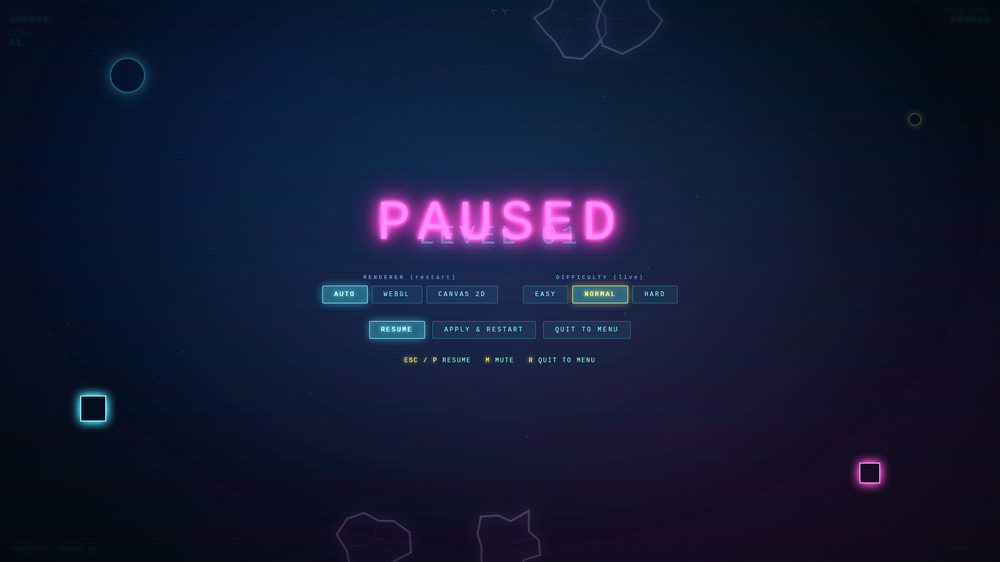 |
| **Gameplay** — ship y asteroides en el espacio | **Menú de pausa** (ESC) con ajustes |

### 🎬 Vídeo de gameplay

Vídeo completo (~2 min 49 s, con sonido) en YouTube:

[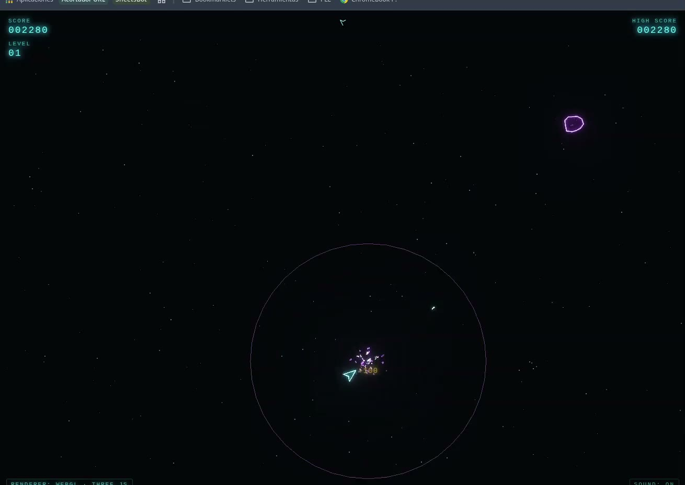](https://youtu.be/3zXxPQNaDPs)

Si el embed no se muestra en tu visor de GitHub, ábrelo directamente: [youtu.be/3zXxPQNaDPs](https://youtu.be/3zXxPQNaDPs)

### 🖼️ Frames destacados del vídeo

Momentos capturados de la propia grabación (tal cual, sin post-procesado):

| | |
|---|---|
| 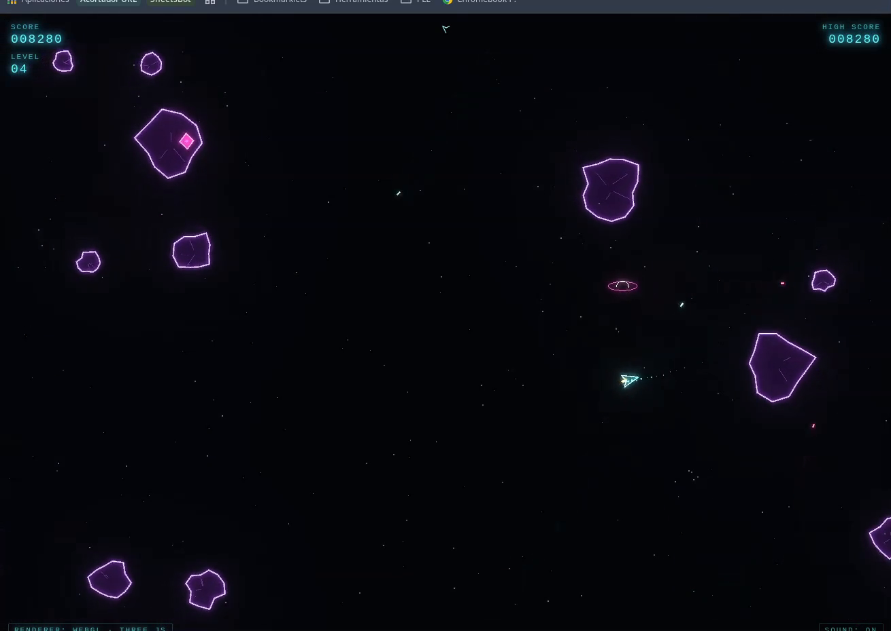 | 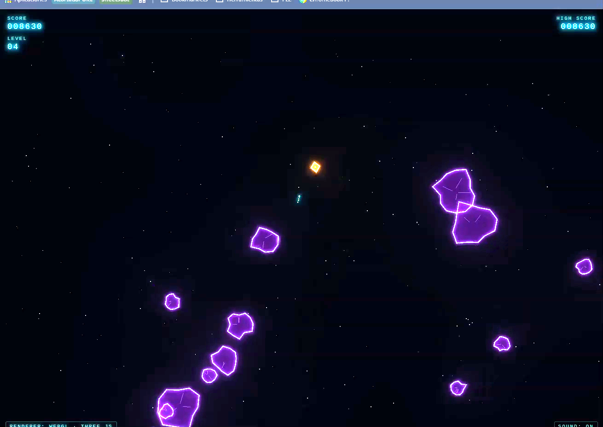 |
| **02:04** — gameplay en acción | **02:10** — gameplay en acción |
| 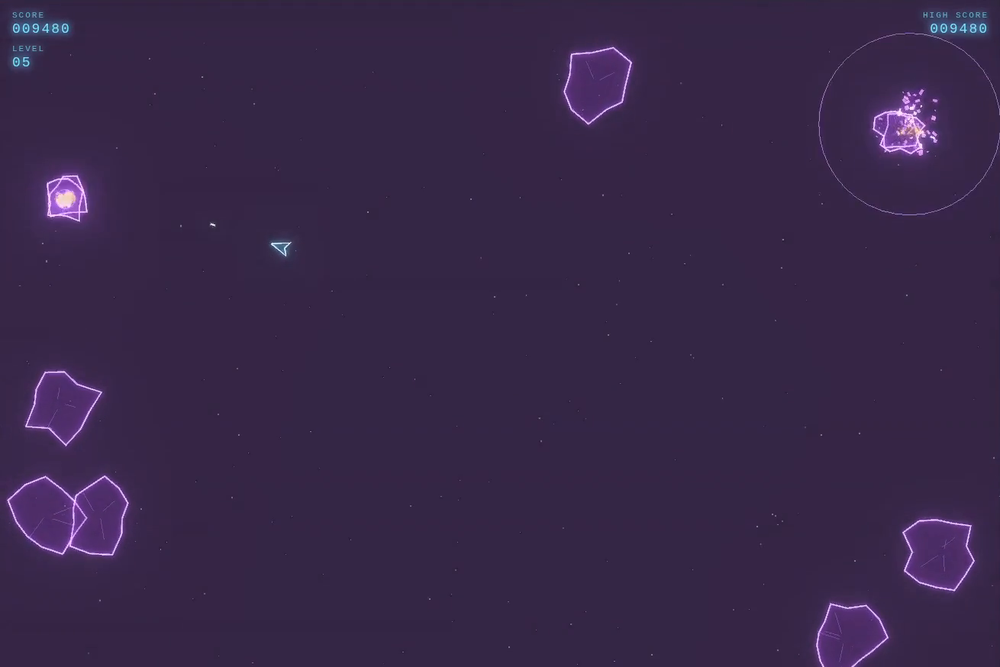 | 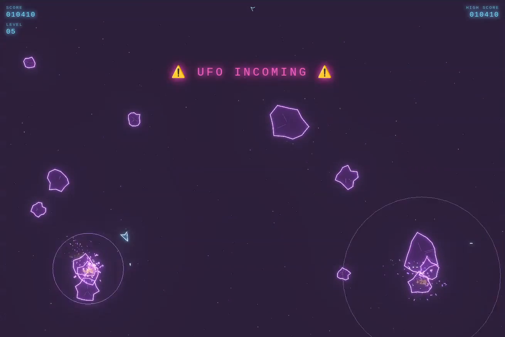 |
| **02:15** — explosión a pantalla completa | **02:23** — racimo de asteroides |
| 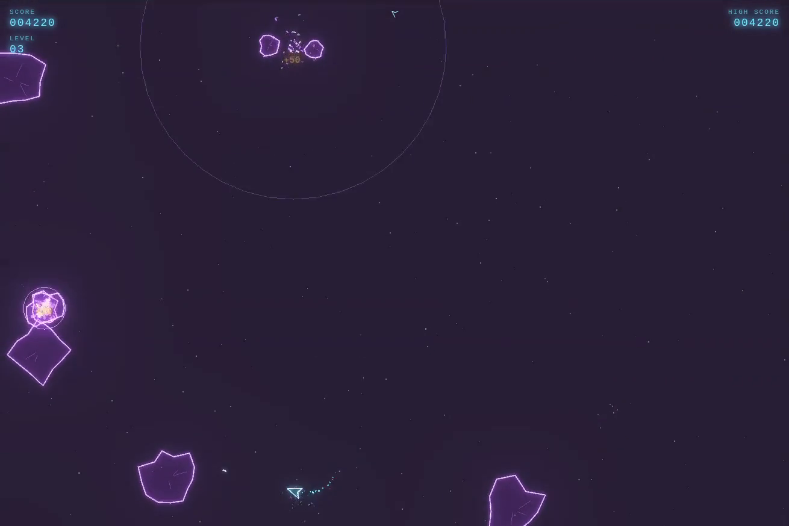 | 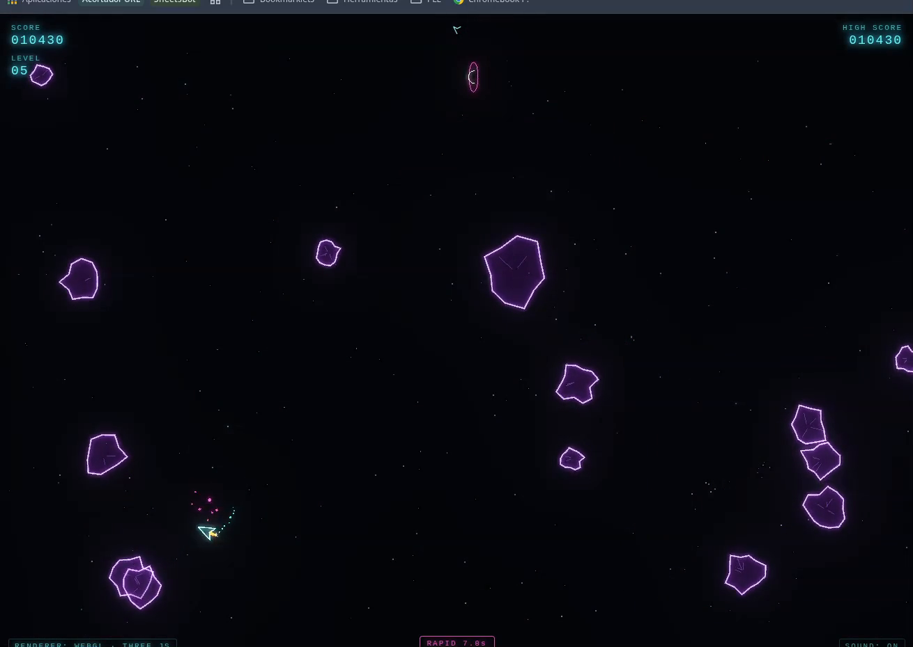 |
| **01:05** — explosión | **02:25** — final de partida |

### 📷 Cómo se tomaron las capturas

Las capturas las hizo el propio asistente, **jugando al juego de verdad** con un navegador automatizado — nadie las tomó a mano:

1. **Automatización**: se lanzó Chrome en modo *headless* (sin ventana) a 1920×1080 mediante `puppeteer-core` (Chrome DevTools Protocol), apuntando a un servidor local con el juego.
2. **Selección de modo y arranque**: en la pantalla de bienvenida se pulsó el botón de dificultad *HARD* (4 asteroides iniciales) y luego `ENTER` para empezar la partida.
3. **Se jugó de verdad**: el script mantuvo pulsada la propulsión (`↑`) y el disparo (`SPACE`) durante ~90 segundos, alternando la rotación (`←`/`→`) en barridos orbitales amplios y disparando el hiperespacio (`Z`) de forma aleatoria, mientras capturaba una captura cada 2 segundos (~30 frames de acción).
4. **Selección automática de los mejores frames**: como el modelo no puede "ver" las imágenes directamente, cada frame se analizó por histogramas de brillo, saturación, recuento de colores distintos y porcentaje de píxeles "neón" (canal RGB > 120), para quedarse con los más vistosos — incluyendo el frame de la **explosión a pantalla completa**.
5. **Menú de pausa**: se pulsó `ESC` durante la partida y se capturó el overlay de pausa.
6. **Sin post-procesado**: las capturas se muestran tal cual salieron del navegador y del vídeo, sin retoques.

Resultado: 4 capturas reales + 6 frames extraídos del vídeo de gameplay, todo sacado de partidas reales jugadas por la IA. 🌌

### 🐍 Scripts Python usados

Además de FFmpeg y de los scripts Node.js/puppeteer que jugaban y capturaban, se usaron pequeños scripts Python con **Pillow (PIL)** para dos tareas:

1. **Análisis y selección de frames** (`Image` + `getdata`): abría cada captura, la reducía a una muestra y calculaba métricas para decidir cuáles valían la pena:
   - **Brillo medio** de todos los píxeles.
   - **% de píxeles brillantes** (`sum(rgb)/3 > 60`) — indica cuánta acción visible hay.
   - **Colores distintos** (`len(set(pixels))`) — cuánto contenido hay.
   - **% de píxeles "neón"** (canal máximo > 120) y distribución por tonos (cian/morado/blanco) para distinguir explosiones reales de destellos lavados.
   - También se hizo un **análisis espacial** (grid 12×8 de presencia de neón) para comprobar si la nave y los asteroides estaban centrados o si el frame era solo fondo vacío.

2. **Verificación de contenido** del vídeo: tras extraer los frames con FFmpeg, un script comprobaba que cada uno tuviera píxeles de neón reales y no fueran frames negros o en blanco.

> Al principio se aplicaba un realce (brillo/contraste/saturación) para que el neón resaltara, pero se ha descartado: las capturas del repo son **tal cual**, sin post-procesado.

### 🎬 Cómo se convirtió el vídeo y se extrajeron los frames

El vídeo que grabaste venía en contenedor **MKV** (códec H.264 + Opus, 70 MB), que muchos navegadores no reproducen en línea y GitHub sirve como archivo plano. El asistente lo convirtió y extrajo fotogramas con **FFmpeg**:

1. **Conversión MKV → MP4** para máxima compatibilidad:
   ```
   ffmpeg -i asteroids-gameply.mkv \
     -c:v libx264 -preset medium -crf 20 -pix_fmt yuv420p \
     -movflags +faststart -c:a aac -b:a 160k asteroids-gameplay.mp4
   ```
   - `libx264` re-codifica el vídeo H.264 manteniendo calidad (`crf 20`).
   - `yuv420p` garantiza compatibilidad con todos los reproductores.
   - `aac` convierte el audio Opus a AAC (estándar en MP4).
   - `+faststart` mueve el índice al principio para que el vídeo arranque rápido al reproducirse en el navegador.
   - Resultado: **34 MB** (desde 70 MB).

2. **Poster frame** (imagen previa del vídeo):
   ```
   ffmpeg -i asteroids-gameplay.mp4 -ss 40 -frames:v 1 -q:v 3 video_poster.jpg
   ```
   Extrae un solo fotograma (`-frames:v 1`) en el segundo 40 (`-ss 40`) como imagen de portada.

3. **Frames destacados** en los momentos que indicaste (01:05, 02:04, 02:10, 02:15, 02:23, 02:25):
   ```
   ffmpeg -ss 65 -i asteroids-gameplay.mp4 -frames:v 1 -q:v 2 frame_65s.png
   ffmpeg -ss 124 -i asteroids-gameplay.mp4 -frames:v 1 -q:v 2 frame_124s.png
   ... (mismo comando con -ss 130, 135, 143, 145)
   ```
   - `-ss` busca directamente al segundo indicado antes de decodificar (rápido y preciso).
   - `-q:v 2` es alta calidad de JPEG (escala 2–31, menor = mejor).
   - Los frames se guardan tal cual, sin post-procesado.

---

## 🕹️ Cómo jugar

| Tecla | Acción |
|---|---|
| `←` / `→` | Rotar la nave |
| `↑` | Propulsión |
| `SPACE` | Disparar |
| `Z` | Hiperespacio (teletransporte de emergencia) |
| `ESC` / `P` | Menú de pausa |
| `M` | Silenciar / activar sonido |
| `R` | Volver al menú (solo en game over / pausa) |
| `ENTER` | Empezar / reiniciar |

**Objetivo:** destruye todos los asteroides del nivel. Cada asteroide grande se divide en dos medianos, y estos en dos pequeños. Cuando el campo está limpio, sube el nivel y la dificultad.

---

## ✨ Características

- **Nave clásica** con propulsión con rozamiento, estela de partículas y llama de empuje animada.
- **Asteroides jagged** (siluetas irregulares y afiladas) generados con *random seeds*: 3 tamaños que se dividen al destruirse.
- **Power-ups** con efecto y duración en HUD:
  - 🛡️ **SHIELD** — escudo temporal, rebota asteroides.
  - 🔫 **RAPID** — cadencia de fuego aumentada.
  - 🎯 **TRIPLE** — disparo en abanico (3 balas).
  - 💥 **BOMB** — limpia la pantalla: todos los asteroides, ovnis y balas enemigas.
- **Ovnis (UFOs)** que aparecen de forma aleatoria con aviso *"⚠ UFO INCOMING ⚠"*, cruzan la pantalla con movimiento sinusoide, **te persiguen y disparan**, tienen vida propia y sueltan un power-up al ser destruidos. Hasta 3 a la vez en niveles altos.
- **Explosiones que llenan la pantalla**: chispas, esquirlas, brasas, ondas de choque expansivas, *screen shake* y destellos de pantalla completa.
- **3 dificultades** ajustables desde el menú (y cambiables en vivo desde la pausa).
- **Puntuación, vidas, niveles, vidas extra** cada 10.000 puntos y **high score persistente** (`localStorage`).
- **Menú AAA** con asteroides a la deriva, estrellas parpadeantes, formas flotantes con animación de *drift + zoom* y título de neón con *flicker*.

---

## 🎵 Audio procedural

Todo el audio se sintetiza con la **Web Audio API** — cero archivos externos:

- **SFX**: disparo, explosiones de asteroide (tono según tamaño), explosión de nave (boom grave + crash), hiperespacio, vida extra, power-up, fuego de ovni, y un chirrido alienígena al aparecer el ovni.
- **Música ambiental** inspirada en *Constance Demby — Novus Magnificat*: un motor evolutivo con capas de **drones** graves (osciladores con *beating*), **pads** de acordes detunados que cambian de escala cada ~11 s, **campanas FM** estocásticas, pulsos graves, LFOs de respiración y **reverb de convolución** sintetizada.
- **Master bus** con compresor/limitador y make-up gain para subir el volumen sin recortar.

---

## 🎨 Técnica: doble renderer

El juego admite **tres modos de render**, elegibles desde el menú (Auto / WebGL / Canvas 2D):

| Renderer | Descripción |
|---|---|
| **WebGL (Three.js)** | Líneas de neón reales construidas con *ribbon geometry* (triángulos con joins en mitra), geometrías procedurales y **UnrealBloomPass** para el glow HDR. |
| **Canvas 2D** | Trazo doble con `shadowBlur` + composición aditiva (`lighter`) para el halo de neón. |
| **Auto** | Intenta WebGL primero y cae a Canvas 2D si el contexto falla. |

Ambos renderers comparten la **misma lógica de juego** (física, colisiones, estado) — solo cambia la capa de dibujo. El badge inferior izquierdo indica el renderer activo, y se puede **cambiar en caliente** desde la pausa (APPLY & RESTART) sin recargar la página.

---

## ⚙️ Detalles técnicos

- **Un solo archivo**: `index.html` (~2.000 líneas) con todo el CSS, HTML y JS embebido.
- **Librerías**: Three.js + addons (`EffectComposer`, `RenderPass`, `UnrealBloomPass`) cargados **dinámicamente** con `import()` vía import map — si eliges Canvas 2D, Three.js ni siquiera se descarga.
- **Formas procedurales**: el *ship*, los asteroides, los power-ups y los ovnis son polígonos generados con `Math.random()` y *seeds* deterministas (el mismo asteroide siempre tiene la misma forma).
- **Colisiones**: por círculos en 2D con *screen wrapping* (el mundo envuelve en los bordes).
- **Física** simplificada de Asteroids: inercia, rozamiento exponencial, velocidad máxima, división de asteroides.
- **Estado**: máquina de estados (menú → jugando → pausa → game over → nivel), transiciones con anuncios y contadores.
- **Dificultad dinámica**: más asteroides por nivel, velocidad +rampa/level, ovnis más rápidos, resistentes y precisos con el tiempo.

---

## 🚀 Cómo ejecutarlo

Al ser un solo archivo, basta con abrirlo en el navegador. Requiere **conexión a internet** la primera vez para cargar Three.js desde el CDN de unpkg (o un caché posterior):

```
xdg-open index.html
```

O sírvelo con cualquier servidor estático:

```
python3 -m http.server 8000
# → http://localhost:8000
```

> ⚠️ Requiere un navegador moderno con WebGL (modo WebGL) o Canvas 2D (modo Canvas). El modo Auto decide por ti.

---

## 🧠 Sobre DeepSeek V4 Flash 0731

Este juego ha sido escrito íntegramente por **DeepSeek V4 Flash 0731** (este asistente), a partir de peticiones en lenguaje natural en español, sin escribir una sola línea a mano.

Puntos fuertes demostrados durante el desarrollo:

- **Código completo y funcional desde el primer intento**, con correcciones rápidas iterando sobre bugs concretos.
- **Refactorizaciones grandes** sin romper el resto: añadir un segundo renderer (Canvas 2D), un motor de audio ambiental y ovnis sobre la marcha.
- **Síntesis de audio y geometría procedural** sin depender de assets externos.
- **Ajuste fino de UX/UI**: menús, hints de teclas, indicadores, estados.
- Y todo ello **consumiendo una cantidad ridículamente baja de tokens** (ver la cita al inicio). 🌿
